```mermaid
%%{init: { 
  'theme': 'base', 
  'themeVariables': { 
    'fontSize': '29px'
  }
}}%%
flowchart LR

%% Make all connectors thicker and a solid black color
linkStyle default stroke:#333,stroke-width:7px

%% Define the color classes (no repeats)
classDef red fill:#F44336,stroke:#fff,stroke-width:2px,color:#fff
classDef purple fill:#9C27B0,stroke:#fff,stroke-width:2px,color:#fff
classDef teal fill:#009688,stroke:#fff,stroke-width:2px,color:#fff
classDef blue fill:#2196F3,stroke:#fff,stroke-width:2px,color:#fff
classDef pink fill:#E91E63,stroke:#fff,stroke-width:2px,color:#fff
classDef orange fill:#FF9800,stroke:#fff,stroke-width:2px,color:#fff
classDef yellow fill:#FFEB3B,stroke:#333,stroke-width:2px,color:#000
classDef amber fill:#FFC107,stroke:#333,stroke-width:2px,color:#000
classDef green fill:#4CAF50,stroke:#fff,stroke-width:2px,color:#fff

A["Raw Data (CSV)"]:::red -->|Processed by Polars| B["Feature Engineering"]:::purple
B -->|Stored in Featureform| C["Feature Store"]:::teal
B -->|Train Model| D["MLflow Model Registry"]:::blue
D -->|Deployed to API| E["FastAPI Model API"]:::pink
E -->|Real-time Predictions| F["Streamlit UI"]:::orange
F -->|User Interaction| G["Interactive Dashboard"]:::yellow
E -->|Monitors Drift| H["Evidently AI"]:::amber
H -->|Triggers Retraining| I["Metaflow Retraining Pipeline"]:::green
I -->|Updates Model| D
```

# 🏗 MLOps Project ⚙️ Extended Body Fat Prediction 🧑‍🔬


---

## 📌 Table of Contents

- [Overview](#-overview)
- [Technologies Used](#-technologies-used)
- [System Architecture](#-system-architecture)
- [Project Folder Structure](#-project-folder-structure)
- [Installation & Setup](#-installation--setup)
- [Example API Request](#-example-api-request)
- [Troubleshooting](#-troubleshooting)
- [Demo](#-demo---fastapi-in-action)
- [Next Steps](#-next-steps)
- [Author](#-about-the-author)
- [License](#-license)

---

## 📌 Overview

This project implements a full **MLOps pipeline** for **predicting body fat percentage** using various body measurements. It includes:

- **Data processing**
- **Model training & deployment**
- **Monitoring & automated retraining**
- **Alerts & notifications**

---

## 🚀 Technologies Used

| **Component**            | **Tool**                      | **Notes**                                        |
|--------------------------|-------------------------------|--------------------------------------------------|
| Infrastructure           | **OpenTofu**                  | IaC to deploy everything                        |
| Workflow Orchestration   | **Metaflow**                  | For data & retraining pipelines                 |
| Data Processing          | **Polars**                    | Fast, Rust-backed pandas alternative            |
| Experiment Tracking      | **MLflow**                    | Tracks runs, metrics, models                    |
| Hyperparameter Tuning    | **Optuna**                    | Powerful, easy-to-use                           |
| Feature Store            | **Featureform**               | Managed feature store                           |
| Model API                | **FastAPI**                   | Low-latency inference                           |
| Model Deployment         | **MLflow Models**             | Built-in support for Docker serving             |
| Model Monitoring         | **Evidently AI + MLflow**     | Monitoring + Metrics                            |
| Real-time Logging        | **FastAPI Logging**           | Logs requests, responses                        |
| Retraining               | **Metaflow + Evidently**      | Data drift triggers retraining                  |
| Alerts & Notifications   | **Slack / Discord Webhooks**  | Real-time status updates                        |
| Web UI / Dashboards      | **Streamlit**                 | Visual analytics                                |
| Database for Logs        | **PostgreSQL**                | App + experiment logs                           |

### CI/CD + Kubernetes Integration

- **OpenTofu**: Infrastructure provisioning  
- **Helm**: Deploy apps/services  
- **GitHub Actions**: CI/CD automation  
- **Minikube**: Local dev/test cluster  
- **Docker**: For app containers

---

## 🏛 System Architecture



---

## 📂 Project Folder Structure

```bash
mlops-project/
│── infra/                   # 🏗 Infrastructure (OpenTofu, Docker)
│   ├── local_setup.tf       # OpenTofu script for local deployment
│   ├── cloud_setup.tf       # OpenTofu script for AWS/GCP deployment
│   ├── docker-compose.yml   # Alternative Docker setup
│── data/                    # 📂 Data files
│   ├── raw/                 # Raw datasets (bodyfat-extended.csv)
│   ├── processed/           # Processed datasets
│── notebooks/               # 📓 Jupyter Notebooks
│   ├── eda.ipynb            # Exploratory Data Analysis
│   ├── model-training.ipynb # Training and hyperparameter tuning
│── src/                     # 📜 Source code for the project
│   ├── fastapi_app/         # API code (FastAPI)
│   │   ├── main.py          # FastAPI app for model serving
│   │   ├── logging.py       # Real-time request logging
│   ├── retraining/          # Retraining workflow (Metaflow)
│   │   ├── retrain_flow.py  # Automated retraining script
│   ├── monitoring/          # Monitoring scripts (Evidently AI)
│   │   ├── drift_detection.py  # Detect model drift
│── models/                  # 🏗 Trained models
│   ├── mlflow/              # MLflow model registry
│── dashboards/              # 📊 Streamlit Dashboards
│   ├── eda_dashboard.py     # Dashboard for EDA & insights
│   ├── prediction_dashboard.py # Dashboard for model predictions
│── scripts/                 # 🏗 Helper scripts
│   ├── run_fastapi.sh       # Start FastAPI
│   ├── run_mlflow.sh        # Start MLflow tracking
│── tests/                   # ✅ Unit & Integration tests
│   ├── test_api.py          # API testing
│   ├── test_model.py        # Model evaluation tests
│── .github/                 # 🛠 GitHub Actions CI/CD
│   ├── workflows/
│   │   ├── deploy.yml       # CI/CD automation
│── pixi.toml                # 📦 Pixi dependency manager
│── README.md                # 📖 Project documentation
│── requirements.txt         # 📦 Additional dependencies (if needed)
│── .gitignore               # 🚫 Ignore unnecessary files
```

---

## 📥 Installation & Setup

### 1️⃣ Clone the Repository

```bash
git clone https://github.com/k2jac9/mlops-project.git
cd mlops-project
```

### 2️⃣ Install Dependencies (Pixi)

```bash
pixi install
```

### 3️⃣ Automate Setup & Deployment

We use a Python CLI (setup.py) to handle installation, deployment, and testing.

```python
python setup.py folders     # Create folders & files
python setup.py install     # Install dependencies
python setup.py deploy      # Deploy infrastructure
python setup.py fastapi     # Run FastAPI API
python setup.py mlflow      # Start MLflow UI
python setup.py streamlit   # Start Streamlit dashboards
python setup.py test        # Run all tests
python setup.py validate    # Validate FastAPI health
```

---

## 🔥 Example API Request

Users can test the FastAPI model via cURL:

```bash
curl -X 'POST'   'http://localhost:8000/predict/'   -H 'Content-Type: application/json'   -d '{"features": [90, 100, 95, 80, 60, 40, 0.5, 0.47, 1.1, 0.9]}'
```

📍 Response Example:

```json
{
  "predicted_body_fat": 22.45,
}
```

---

## 🚑 Troubleshooting

🔹 Issue: `ModuleNotFoundError: No module named 'mlflow'`

Solution:

```bash
pixi install
```

🔹 Issue: `tofu: command not found`

Solution:

```bash
curl -fsSL https://opentofu.org/install.sh | sh
🔹 Issue: FastAPI API is not accessible
```

- Check logs for errors.
- Ensure port 8000 is not blocked.

Solution:

```bash

python setup.py fastapi
```

---

## 🎥 Demo - FastAPI in Action

📌 GIF shows FastAPI running & returning predictions.

---

## 🚀 Next Steps

✅ Deploy the setup to AWS/GCP using OpenTofu

✅ Run performance tests on the FastAPI API

✅ Optimize training pipeline with Spark/Dask

---

## 🧑‍💻 About the Author

Alejandro Castellanos
📍 Data Scientist based in Toronto (EST/GMT-4/UTC−04:00)

I explore AI technology and data science while diving into neuroscience, physics, and philosophy. Also passionate about hiking, sports, and film as an art form.

>"In the dance of quarks and stardust light,
>Humans tread, both wrong and right.
>The quest for truth is a recurring theme."
>
>"Errors made, in history's shade,
>Lessons learned, yet oft betrayed.
>We ponder existence, our choices, our fate."
>
>"Seek understanding, a collective plan.
>For in the blend of code and emotion's plea,
>Lies the essence of what it means to be."

### 🤝 Let's Connect!

🔗 GitHub: [k2jac9](https://github.com/k2jac9)

🔗 LinkedIn: [Alejandro Castellanos](https://www.linkedin.com/in/aicastellanos)


## 📜 License

This project is licensed under the MIT License.