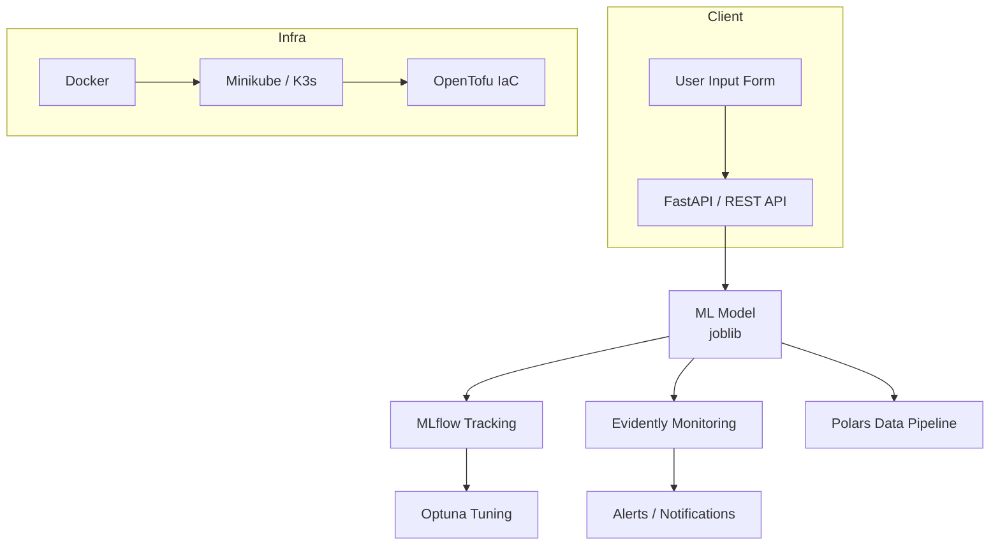

# LeanAI

# 📌 Predicting Body Fat Percentage Using Machine Learning

## 🧠 Project Summary

This project utilizes the **Body Fat Prediction Dataset & Extended** from Kaggle, which contains anthropometric measurements such as weight, height, waist circumference, and body fat percentage.

### ✅ Key Result

Achieved < 1% error with SVR model using body measurements only.

### 📊 Results Summary

| Model             | MAE  | R²     | MAPE   |
|------------------|------|--------|--------|
| SVR (best)        | 0.10 | 0.9996 | 0.86%  |
| MLPRegressor      | 0.24 | 0.9979 | 1.82%  |
| Linear Regression | 0.50 | 0.9925 | 3.79%  |

---

### 🛠️ Tech Stack

| Layer                  | Tool/Framework        |
|------------------------|------------------------|
| Infrastructure         | OpenTofu, Docker, K3s  |
| Data Processing        | Polars, Scikit-learn   |
| Workflow Orchestration | Metaflow               |
| Model Tracking         | MLflow                 |
| HPO                    | Optuna                 |
| Monitoring             | Evidently AI           |
| API                    | FastAPI                |
| Frontend               | Streamlit              |
| Deployment             | Docker / K8s (Minikube/K3s) |

---

### 🔹 Business Objective

⚡ **Develop a machine learning model to predict body fat percentage** based on a person's physical measurements.

### 📌 Why is this important?

- **🏋️ Fitness & Health**: Personalized recommendations for diet and exercise.
- **🏥 Medical Diagnosis**: Assessment of obesity, diabetes, and cardiovascular disease risks.
- **🏆 Sports Industry**: Optimization of body composition for athletes.
- **💰 Insurance**: Health risk analysis for premium calculation.

From a business perspective, using anthropometric measurements like weight, height, and waist circumference to predict body fat percentage can have several practical and profitable motivations:

### 1. Health and Fitness Industry Applications

- **Motivation**: The ability to estimate body fat percentage without expensive equipment (like DEXA scans or hydrostatic weighing) makes health assessments more accessible and cost-effective.
- **Business Use Case**: Fitness companies (e.g., gyms, personal training services, or wearable tech firms like Fitbit or Apple) could integrate this into their offerings. For example, a gym could use a simple app or kiosk where clients input their measurements to get an instant body fat estimate, enhancing customer engagement and retention.
- **Value Proposition**: Low-cost, scalable health insights encourage users to track progress, purchase subscriptions, or invest in personalized training plans.

### 2. Cost Reduction and Scalability

- **Motivation**: Traditional body fat measurement methods are time-consuming, expensive, and require trained personnel or specialized tools. Anthropometric predictions bypass these barriers.
- **Business Use Case**: A startup could develop a SaaS (Software as a Service) platform targeting small clinics, schools, or corporate wellness programs, providing affordable body fat analysis tools based on these measurements.
- **Value Proposition**: Businesses save money while offering a valuable service, creating a competitive edge over rivals relying on pricier alternatives.

### 3. Personalized Product Offerings

- **Motivation**: Body fat percentage is a key metric for tailoring nutrition plans, workout regimes, or even apparel sizing.
- **Business Use Case**: E-commerce platforms (e.g., meal kit services like HelloFresh or fitness apparel brands like Lululemon) could use this data to recommend products suited to a customer’s body composition, increasing sales conversion rates.
- **Value Proposition**: Enhanced personalization drives customer satisfaction and loyalty, boosting revenue through targeted upselling.

### 4. Public Health and Insurance Insights

- **Motivation**: Body fat percentage is a better indicator of health risks (e.g., obesity-related diseases) than BMI alone, which can misclassify muscular individuals.
- **Business Use Case**: Insurance companies or public health organizations could use this predictive model to assess risk profiles at scale, adjusting premiums or designing intervention programs.
- **Value Proposition**: More accurate risk assessment reduces payouts for insurers or improves outcomes for health initiatives, saving costs long-term.

---

## 2️⃣ Data

📂 **Data Source**: [Kaggle: Body Fat Prediction Dataset](https://www.kaggle.com/datasets/simonezappatini/body-fat-extended-dataset)  
📊 **Format**: CSV file  
💾 **Dataset Size**: 436 samples, 16 columns.

### 🔢 **Features in the dataset**

- `Density` – Body density (measured by hydrostatic weighing).
- `BodyFat` – **Body fat percentage (target variable)**.
- `Age` – Age.
- `Weight` – Weight (in pounds).
- `Height` – Height (in inches).
- `Neck`, `Chest`, `Abdomen`, `Hip`, `Thigh`, `Knee`, `Ankle`, `Biceps`, `Forearm`, `Wrist` – Circumference measurements of different body parts (in inches).

---

## 3️⃣ Methodology

### 📊 Exploratory Data Analysis (EDA)

- [Bodyfat EDA Methodology](Project/EDA/README.md)

- Dataset was **clean**, numeric, and no nulls.
- **Visualizations** revealed normal distributions with minor skewness.
- Strong correlations:
  - **Negative**: BodyFat vs Density
  - **Positive**: Abdomen & Chest vs BodyFat
- **Sex-based analysis** showed anatomical differences, but **Sex** had a weak impact on body fat prediction.

### Details

Our initial exploratory steps were the standard tasks of determining the number of features in the dataset, identifying any null or missing values, observing the scale of individual features and the data types we had to work with.  The dataset, although small, was very clean: no missing or null values, only floating and integer data types, and a total of 14 features.  A couple of important notes: the data was taken of men only, density was measured using under water weighing, and the remaiming features were measured using the measurement standards listed in Benhke and Wilmore (1974), pp. 45-48.

Matplotlib was used to visualize the distribution of the dataset, providing a deeper understanding of the spread of each feature.


Most features follow a normal distribution, except for height, hip, and ankle, which exhibit slight skewness.
A heatmap was applied to determine the correlation between different features, revealing a strong negative correlation between body fat and density. Additionally, weight shows a strong positive correlation with hip, chest, and abdomen size.  

We also utilized boxplots to identify outliers.


Since our dataset initially contained only male measurements, which is a limition,  we extended our analysis to include female samples for a more comprehensive evaluation.
Exploratory Data Analysis (EDA), particularly through heat maps, revealed significant sex-based differences in body measurements. In our dataset, we encoded females as "1" and males as "0." We observed strong negative correlations for certain measurements, including Neck (-0.84), Forearm (-0.81), Wrist (-0.81), Chest (-0.71), Abdomen (-0.78), and Weight (-0.67). These findings indicate that males generally have larger body measurements than females. However, when assessing the influence of sex on body fat prediction, the effect appeared minimal (0.17).
Abdomen circumference emerged as a key indicator of body fat percentage, showing strong correlations with Body Fat (0.36), Chest (0.92), Hip (0.68), and Thigh (0.85).
Weight, on the other hand, was more strongly associated with skeletal and muscular body measurements rather than body fat alone. It exhibited high correlations with Chest (0.91), Abdomen (0.93), Hip (0.81), and Thigh (0.91), suggesting that weight increases in proportion to overall body dimensions.

Overall, the dataset highlights strong relationships between various body measurements, making it valuable for predictive modeling in health and fitness.


**Data Processing**
Since the time limtation and the dataset is relatively simple and small, we decide to use as it is to start with a simple linear regression model initiatlly

### **Model Development**

- Given the dataset's size and simplicity, we began with lightweight models to establish a strong baseline.


- Dataset was **clean**, numeric, and no nulls.
- **Visualizations** revealed normal distributions with minor skewness.
- Strong correlations:
  - **Negative**: BodyFat vs Density
  - **Positive**: Abdomen & Chest vs BodyFat
- **Sex-based analysis** showed anatomical differences, but **Sex** had a weak impact on body fat prediction.

### 📈 Key Insights

- **Abdomen circumference** is the strongest single predictor.
- **Weight** correlates more with muscle mass than fat.

### 🧠 Feature Engineering

Custom features:

- `bmi = Weight / (Height/100)^2`
- `waist_to_hip = Abdomen / Hip`
- `waist_to_height = Abdomen / Height`
- `arm_ratio = Forearm / Biceps`

---

### 🧪 Modeling Strategy

Started simple due to data size:

- ✅ **Linear Regression** (baseline)
- ✅ **SVR + RFE + PCA** (enhanced model)
- ✅ **Separate models**: Male / Female / Combined

**Metrics**:

- MAE, RMSE, R²
- Evidently AI reports for:
  - Data Drift
  - Target Drift
  - Regression Performance

## 4️⃣ Machine Learning Solution

- ⚙️ **Data Processing**: Polars, Scikit-Learn
- 🔁 **Workflow**: Metaflow
- 📊 **Experiment Tracking**: MLflow
- 🔍 **Monitoring**: Evidently AI
- 🧪 **Tuning**: Optuna
- 📦 **API**: FastAPI
- 📤 **Serving**: Streamlit dashboard
- 📂 **Model Storage**: joblib + MLflow Artifacts



---

## 5️⃣ FastAPI Backend

This project includes a **FastAPI-based application** for predicting body fat percentage. The API provides both:  

- A **web form** for manual input  
- A **REST API** for external integration  

🔗 **[Full API Documentation](Project/api/README.md)**

### 🚀 Quick Start  

#### Run the API using Docker  

```bash
docker-compose up --build  # First time setup
docker-compose up          # Subsequent runs
```

- **Access the web interface**: [http://localhost:8000](http://localhost:8000)  
- **API documentation (Swagger UI)**: [http://localhost:8000/docs](http://localhost:8000/docs)  

### 🔹 Example API request  

```bash
curl -X POST "http://localhost:8000/predict/" \
     -H "accept: application/json" \
     -H "Content-Type: application/x-www-form-urlencoded" \
     -d "abdomen=110&hip=120&weight=100&thigh=190&knee=50&biceps=38&neck=45"
```

For detailed instructions on deployment, troubleshooting, and advanced configurations, check out the **[API README](Project/api/README.md)**.  

---

## 6️⃣ 🚀 Real-World Applications & Impact

### 📈 Business & Health Significance

This project offers a unique intersection of machine learning, healthcare, and operational efficiency across several sectors:

🧬 Personalized Health & Fitness
Diet & Exercise Recommendations
Tailored guidance based on predicted body composition — enabling individuals to track progress, set goals, and adjust habits effectively.

🏥 Medical Diagnostics
Risk Assessment for Chronic Conditions
Early detection and monitoring of obesity, diabetes, and cardiovascular risks using body composition insights without expensive hardware.

⚙️ Healthcare AI Integration
AI-Driven Decision Support
Integration into clinical or wellness platforms as a backend service to streamline triage, health assessments, or preventative care recommendations.

🏅 Sports & Athletic Optimization
Performance Enhancement
Coaches and athletes can optimize training programs by targeting fat-to-muscle ratios using easy-to-measure inputs.

💼 Insurance & Actuarial Applications
Improved Risk Modeling
More accurate, personalized health profiles for premium calculations, reducing overgeneralization and unfair pricing.

💸 Operational Cost Savings Across Industries
Scalable, Non-Invasive Alternatives
Eliminates the need for expensive tools like DEXA scans or calipers — allowing schools, gyms, and clinics to adopt accessible predictive solutions at scale.

### Results after optimized experiments

```bash
Model Evaluation Results:
                        MAE        MSE        R2      MAPE  Explained Variance
SVR                0.103007   0.019722  0.999635  0.008664            0.999635
MLPRegressor       0.248110   0.111931  0.997926  0.018232            0.997995
StackingRegressor  0.319352   0.288114  0.994661  0.034541            0.995342
LinearRegression   0.506027   0.401387  0.992562  0.037945            0.992584
Ridge              0.525192   0.429619  0.992039  0.039954            0.992058
GradientBoosting   1.315073   2.867866  0.946855  0.090566            0.946890
XGBoost            1.501784   4.675057  0.913365  0.097473            0.913372
RandomForest       1.702659   4.836746  0.910369  0.127730            0.910589
Lasso              2.070826   6.018619  0.888468  0.166688            0.889867
AdaBoost           2.290862   7.710425  0.857116  0.177951            0.857432
ElasticNet         2.861452  11.469599  0.787454  0.238231            0.788342
```

🚀 This project supports proactive health monitoring and informed decision-making, while delivering operational efficiencies across multiple sectors. 🎯

| Team Member             | Email Address                     | Video Link                                                             |
|-------------------------|---------------------------------- |------------------------------------------------------------------------|
| Igor Bak                | <baxwork88@gmail.com>             | [Watch](https://vimeo.com/1068619321/4818f)                            |
| Alejandro Castellanos   | <k2jac9@users.noreply.github.com> | [Watch](https://vimeo.com/1068619321/a44818f)                          |
| Faisal Khan             | <fa.khan@alumni.utoronto.ca>      | [Watch](https://vimeo.com/1068619321/2e0a44818f)                       |
| Hassan Saade            | <saadehassan@hotmail.com>         | [Watch](https://vimeo.com/1068619321/2e0a44818f)                       |
| Anna Wong               | <annawong.qea@gmail.com>          | [Watch](https://vimeo.com/1068619321/                                  |
